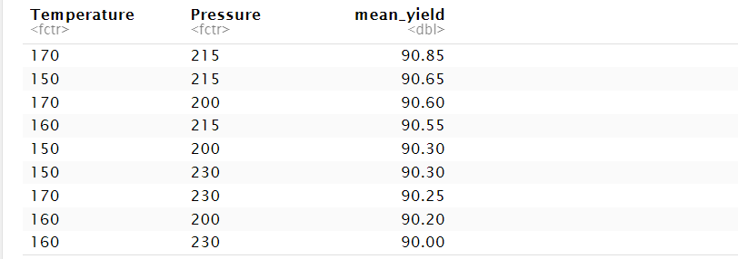
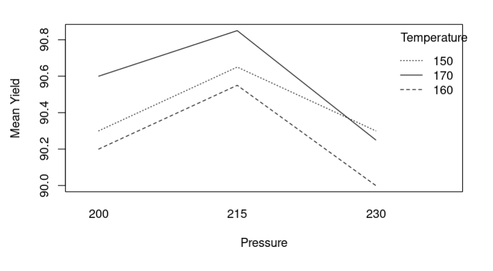
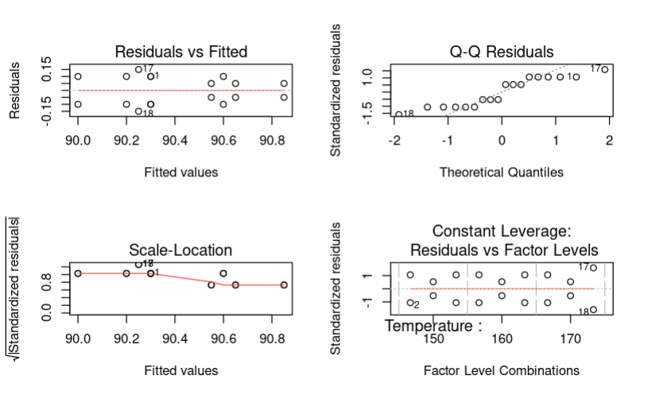

# Two-Way ANOVA Yield Analysis

This project demonstrates a **two-way factorial ANOVA analysis** to evaluate the effects of **Temperature** and **Pressure** on **Yield**, 
including interaction assessment, post-hoc comparisons, and model diagnostics.

---

## 📌 Project Overview

The objective of this project is to:

- Analyze the main effects of **Temperature** and **Pressure** on Yield
- Examine whether an interaction effect exists between the two factors
- Identify the factor-level combination that maximizes mean Yield
- Validate model assumptions through diagnostic checks

This project demonstrates a **complete statistical analysis pipeline**, from experimental design to model diagnostics and interpretation.

---

## 🧪 Experimental Design

- **Response variable**: `Yield`
- **Factors**:
  - **Temperature**: 150, 160, 170
  - **Pressure**: 200, 215, 230
- **Design**: Two-factor full factorial design
- **Replication**: 2 replicates per factor-level combination  
- **Total observations**: 18

---

## 📊 Statistical Methods

- Two-way ANOVA with interaction:
  - `Yield ~ Temperature * Pressure`
- Post-hoc multiple comparisons:
  - Tukey HSD for significant main effects
- Model diagnostics:
  - Residuals vs Fitted
  - Normal Q-Q plot
  - Scale-Location plot
  - Residuals vs Factor Levels

All analyses are conducted in **R** with clear, well-documented code.

---

## 🔍 Key Results

- **Temperature** has a statistically significant effect on Yield  
- **Pressure** has a statistically significant effect on Yield  
- **Interaction (Temperature × Pressure)** is *not statistically significant*
- The **highest mean Yield** is observed at:
  - **Temperature = 170**
  - **Pressure = 215**
These results indicate that Temperature and Pressure independently influence Yield,
while their interaction effect is negligible within the studied range.

---

## 📈 Visualizations

The following outputs are included in this project:

1. **Mean Yield Summary Table**  
   - Displays average Yield for each Temperature–Pressure combination
  
   

    ---
   
2. **Interaction Plot**  
   - Visualizes trends across Pressure levels for each Temperature
   - Supports the conclusion of no strong interaction effect

   

    ---
   
3. **Residual Diagnostic Plots**  
   - Used to assess normality, homoscedasticity, and model adequacy

  

  ---
  
These visualizations support both **interpretability** and **statistical validity**.

---

## ▶️ How to Run

1. Open `two_way_anova_yield_analysis.Rmd` in RStudio / Posit
2. Ensure required packages are installed:
   ```r
   install.packages("dplyr")
3. Knit the R Markdown file to HTML or PDF to reproduce all results

---

## 🧠 Skills Demonstrated

Experimental design (factorial design with replication)

Two-way ANOVA and interaction analysis

Post-hoc multiple comparisons (Tukey HSD)

Statistical model diagnostics

Reproducible research with R Markdown

Clear analytical communication

---

## ✍️ Author

Yiran Han
